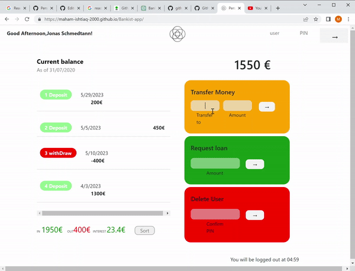

# Bankist-app

An application built with HTML, CSS, Bootstrap, and JavaScript which allows users to take bank loans, transfer money to registered users, delete accounts, and auto-logout after 5 minutes. It also provides a transaction history feature.


## Project GIF

<div class="gif-container" style="display: flex; justify-content: center; margin-left: auto; margin-right: auto;">
    
</div>

## 🛠️ Installation Steps

1. Clone the repository

```bash
git clone https://github.com/maham-ishtiaq-2000/Bankist-app.git
```

2. Change the working directory

```bash
cd Bankist-app.git
```

3. Install dependencies

```bash
npm install -y
npm install parser
```

4. Run the app

```bash
npx index.html
```

🌟 You are all set!

## 🍰 Reflection

During my sixth semester at University, I undertook this one-week-long project aimed at leveraging the technologies I had learned thus far while also exploring new features. The primary goals of this project were to apply my knowledge of HTML, CSS, and JavaScript and incorporate Bootstrap to enhance the responsiveness of the application across different devices.

## 💻 Built with

